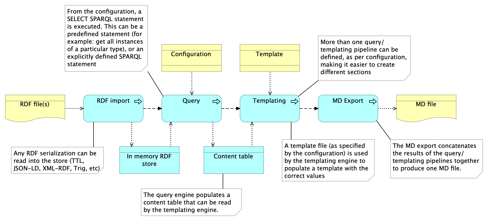

# High level design

To implement this high level design, we will use:

- [Apache jena](https://jena.apache.org) to read the RDF files, to store the resulting triples in the in-memory jena triplestore and to execute queries.
- [Pebbles](https://pebbletemplates.io) as templating engine.
- Yaml configuration files.
- Markdown templates (and export).

The result should be highly flexible, making it possible for anybody to create new "widgets" containing predefined configurations and templates.

This first version will be geared towards MarkDown files, but the full solution could actually include more file types, for example a SVG file to create diagrams.
